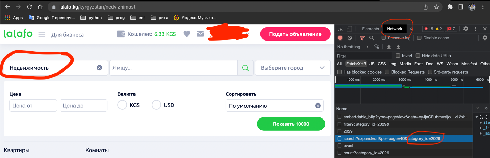

# Async Parsing lalafo.kg

Script for parsing ads from site lalafo.kg by categories.

You can get category ids and request url for api from devtools of your browser:


# Installation and running
You will need Python version 3.9 or higher for the project
1. Clone the repository
2. Create a virtual environment:

```bash
python -m venv venv
```

3. Activate the virtual environment:
```bash
source venv/bin/activate

or

venv\Scripts\activate (for Windows)
```
4. Install requirements:
```bash
pip install -r requirements.txt
```


To run the parsing:
```
python main.py
```
